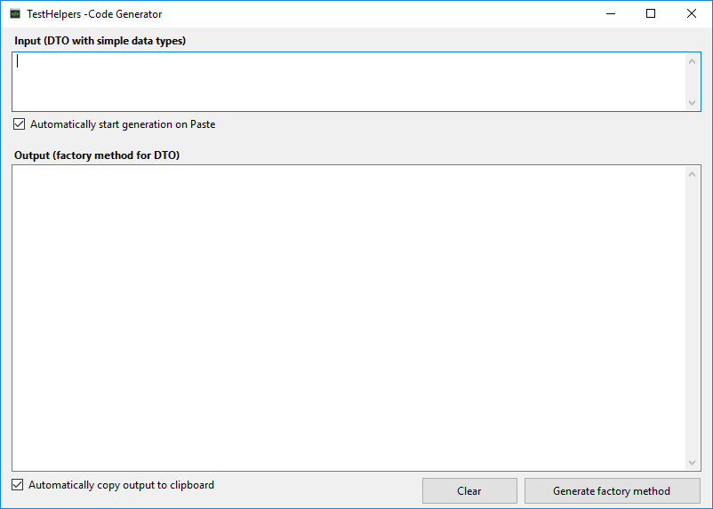

# TestHelpers.CodeGenerator
WinForms app that helps you create factory methods for DTO:s

## Getting started
- Clone or download the repo.
- Build and run the application.
- Paste the DTO class into the input field.




## Use case
When creating unit tests it is often helpful to create instances of DTO:s that has default values.
It makes creation of objects easy and not so verbose. It is also helpful if the default values are unique in order to assert that assignments and mapping has been correctly performed.

Consider the following example:
 ```c#
public class SampleDto
{
    public string FirstName { get; set; }
    public string LastName { get; set; }
    public int Age { get; set; }
    public int NumberOfChildren { get; set; }
}
```

I would end up manually typing the corresponding factory method:
 ```c#
public static SampleDto CreateSampleDto(
	string firstName = "DefaultFirstName",
	string lastName = "DefaultLastName",
	int age = 1,
	int numberOfChildren = 2)
{

	return new SampleDto
	{
		FirstName = firstName,
		LastName = lastName,
		Age = age,
		NumberOfChildren = numberOfChildren
	};
}
```
By convention I am using "Default" as a prefix for all string properties followed by their name to simplify assertion of assignments. 
Numbers are assigned incrementally so that each property get its own unique value (starting from 1 to avoid confusion with the default value 0!).

Even for small classes like this it gets a bit teadious to type. Enter TestHelpers.CodeGenerator!

## Code generation
The code generator is an experiment using the Roslyn compiler to compile the DTO class in order to do some refelction and generate a factory method automatically.
Currently the code generator is limited to handle native data types found in the System and System.Collections.Generic namespaces but if you have nested custom objects you can provide them as well.

Example with nested classes:
 ```c#
public class SampleDto
{
    public string FirstName { get; set; }
    public string LastName { get; set; }
    public int Age { get; set; }
    public NestedDto Partner { get; set; }    
    public IReadOnlyCollection<NestedDto> Children { get; set; }
}

public class NestedDto
{
    public string SomeProp { get; set; }
}
```

When pasting both classes into the code generator the following output will be generated:
 ```c#
public static SampleDto CreateSampleDto(
	string firstName = "DefaultFirstName",
	string lastName = "DefaultLastName",
	int age = 1,
	NestedDto child = null,
	IReadOnlyCollection<NestedDto> children = null)
{

	return new SampleDto
	{
		FirstName = firstName,
		LastName = lastName,
		Age = age,
		Child = child,
		Children = children ?? new List<NestedDto>()
	};
}

public static NestedDto CreateNestedDto(
	string someProp = "DefaultSomeProp")
{

	return new NestedDto
	{
		SomeProp = someProp
	};
}
```